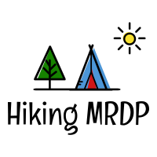

# Happy Hikers

This app ....

* [Link to project hosted on Heroku](https://hiking-mdrp.herokuapp.com/)
* [Link to project hosted on Github](https://github.com/dli24/Hiking_Django)

---

## User Stories
---
_A user  should be able to:_
1. User can sign/login to join and add hike.
2. A user won't  get email spam.
3. A user can  enter personal information as quickly and easily. 
4. User can look calender for upcoming hike.
5. User can comment and rate the hike.
6. User can see the address and the location from google map.


## MVP
---
* View list of hikes by date.
* View calendar of hikes by month.
* View hike detail.
* View hike location on map.
* Shared header and footer.
* Login/Signup.
* Add, Update, Delete hike.
* I'm going on hike.
* comment on hike (text)
* About us page

## Diagram
---
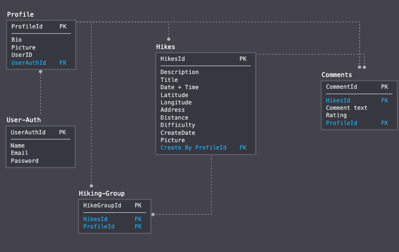


## Technologies Used
---
* Django
* PostgreSQL
* HTML/CSS
* Bootstrap
* JQuery
* AJAX
* Javascript
* Heroku
* Github
* Google API
* Screencastify
* Whiteboards
* Instructors & Peers


### Highlighted code

Calendar

```

  const renderCal = (date=new Date()) => {
    let month = date.getMonth(),
      year = date.getFullYear(),
      first = new Date(year, month, 1),
      last = new Date(year, month + 1, 0),
      startingDay = first.getDay(),
      thedate = new Date(year, month, 1 - startingDay),
      todayString = new Date().toDateString(),
      i, j;


```


## Planned Features
---
Add:
* Newsletter signup.
* Upload picture.
* Show pic from google maps.


## Wireframes
---
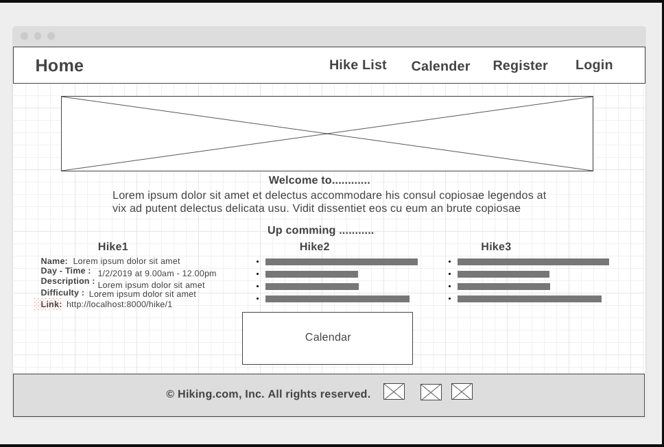
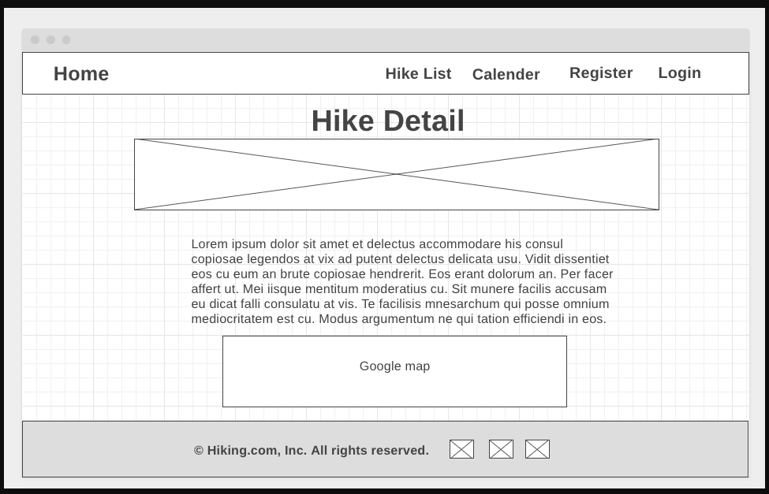
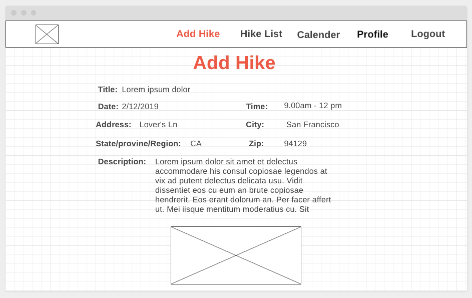
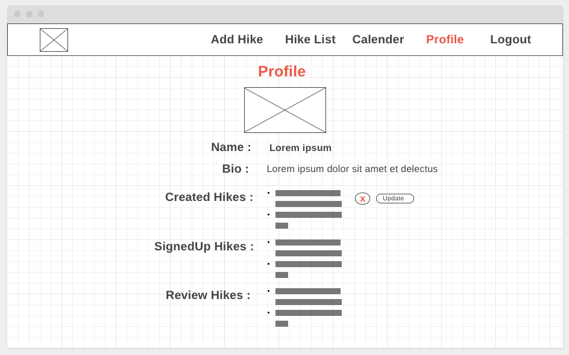
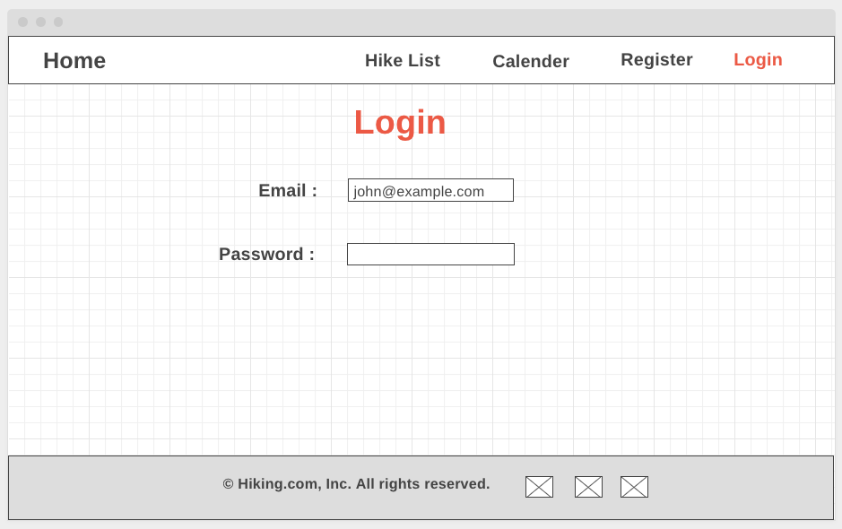
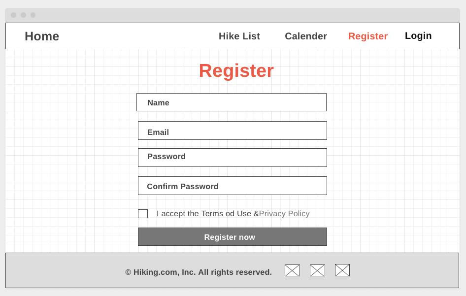
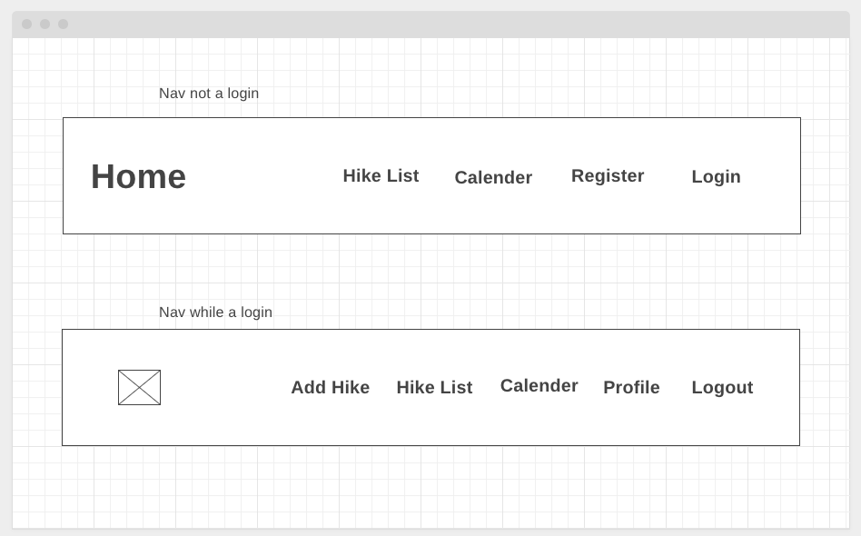

---

##### Screenshot


##### Brainstorming

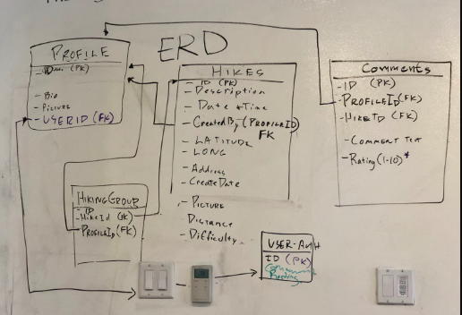
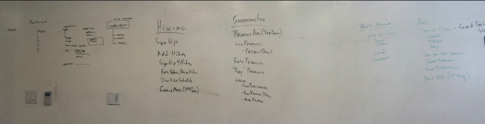


## Built With

* [Wireframe.cc](http://wireframe.cc) - The web framework used
* [MySQL-Diagram](https://app.sqldbm.com/MySQL/Draft/#) - Database Modeler


## Teams

* Michael
* Ridwan
* David
* Kanjamad(Paw)

